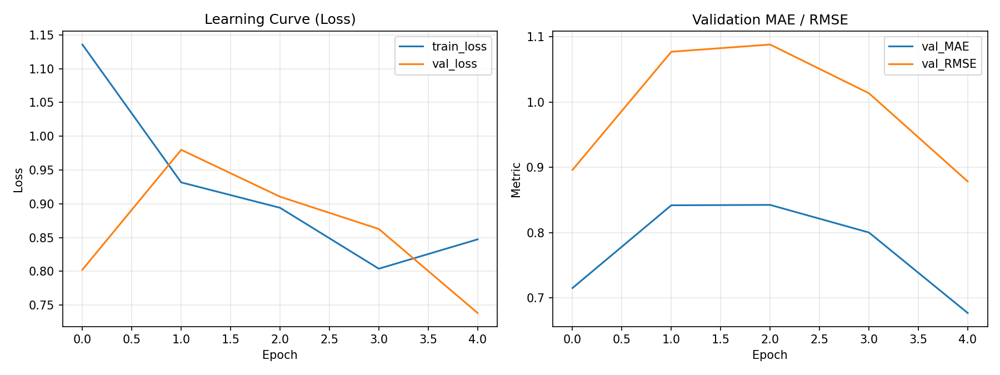

# Polymer Property Prediction: Dry-run 실행 결과 보고서

## 1. 목적

본 점검은 이미지 기반 다중 물성 예측 학습 파이프라인이 데이터 로딩, 모델 학습, 검증, 체크포인트 저장 및 예측 결과 저장까지 정상 수행되는지 확인하기 위해 실시하였다. 실행은 축소 데이터와 2 epoch 설정의 dry-run으로 수행하였다.

```bash
python -m training.train --dry-run
```

## 2. 사용 데이터

전처리된 메타데이터(`data/processed/processed_metadata.csv`)에는 총 8,977개 시료가 있으며, 학습용 8,974개와 테스트용 3개로 구성되어 있다. 각 물성은 측정값이 있는 시료만 손실 및 평가에 반영하는 mask 방식을 사용한다.

| 물성 | 유효 라벨 수 | 결측 수 | 평균 | 표준편차 | 최소 ~ 최대 |
|---|---:|---:|---:|---:|---:|
| Tg | 557 | 8,420 | 99.693 | 110.976 | -148.030 ~ 472.250 |
| FFV | 7,892 | 1,085 | 0.367 | 0.029 | 0.227 ~ 0.777 |
| Tc | 867 | 8,110 | 0.257 | 0.101 | 0.047 ~ 1.590 |
| Density | 613 | 8,364 | 0.985 | 0.146 | 0.749 ~ 1.841 |
| Rg | 614 | 8,363 | 16.420 | 4.605 | 9.728 ~ 34.673 |

FFV를 제외한 물성은 결측 비율이 높으므로, 향후 본 학습 결과를 해석할 때 물성별 유효 표본 수 차이를 반드시 고려해야 한다.

## 3. 실행 설정

| 항목 | 설정 |
|---|---|
| 모델 | ResNet-18 |
| 출력 물성 | Tg, Density, FFV, Tc, Rg (5개) |
| 손실 함수 | Masked MSE |
| 기본 학습률 | 0.0001 |
| Optimizer | AdamW |
| Scheduler | Cosine annealing |
| Dry-run epoch | 2 |
| 입력 이미지 크기 | 224 × 224 |

## 4. 학습 및 검증 수치

아래 값은 `runs/dry_run`의 TensorBoard 로그와 `training/dry_run_checkpoints`의 성공 실행 산출물에서 정리하였다. MAE, RMSE, R²는 5개 물성에 대한 평균값이다.

| Epoch | Train loss | Validation loss | Validation MAE | Validation RMSE | Validation R² | Learning rate |
|---:|---:|---:|---:|---:|---:|---:|
| 1 | 0.859655 | 1.540461 | 0.993191 | 1.158015 | -0.725120 | 0.00010000 |
| 2 | 0.990080 | 0.644440 | 0.768058 | 0.854010 | -0.077820 | 0.00005050 |

Epoch 1 대비 Epoch 2에서 validation loss는 약 58.2%, MAE는 약 22.7%, RMSE는 약 26.3% 감소하였다. R² 역시 -0.725에서 -0.078로 개선되었으나 아직 음수이므로, 이 2 epoch dry-run 모델은 평균 예측 기준보다도 충분한 일반화 성능을 확보했다고 판단할 수 없다. 본 실행은 성능 평가가 아니라 파이프라인 정상 작동 여부를 확인하기 위한 검증이다.

## 5. 학습 곡선



원본 이미지 파일: [dry_run_learning_curve.png](dry_run_learning_curve.png)

## 6. 테스트 데이터 예측 결과

테스트용 3개 폴리머 시료에 대한 역정규화 예측값은 아래와 같다. 전체 원본 수치는 [dry_run_predictions.csv](dry_run_predictions.csv)에서 확인할 수 있다.

| ID | Tg | FFV | Tc | Density | Rg |
|---:|---:|---:|---:|---:|---:|
| 1109053969 | 21.7294 | 0.3622 | 0.3121 | 0.9746 | 17.3702 |
| 1422188626 | 64.5758 | 0.3760 | 0.2478 | 0.9559 | 15.6444 |
| 2032016830 | 33.9808 | 0.3670 | 0.2908 | 0.9922 | 16.3747 |

## 7. 산출물 확인

| 산출물 | 위치 | 확인 결과 |
|---|---|---|
| 최적 모델 체크포인트 | `training/dry_run_checkpoints/best_model.pth` | 생성됨 (약 134 MB) |
| 최종 모델 체크포인트 | `training/dry_run_checkpoints/last_model.pth` | 생성됨 (약 134 MB) |
| TensorBoard 로그 | `runs/dry_run/` | 생성됨 |
| 학습 곡선 이미지 | `reports/dry_run_learning_curve.png` | 생성됨 (1800 × 675 px) |
| 테스트 예측 CSV | `reports/dry_run_predictions.csv` | 생성됨 (3개 시료) |
| 지표 요약 CSV | `reports/dry_run_metric_summary.csv` | 본 보고서와 함께 생성 |

## 8. 결론 및 향후 계획

Dry-run을 통해 학습·검증·체크포인트 저장·학습곡선 저장·테스트 예측 저장으로 이어지는 기본 파이프라인이 동작함을 확인하였다. 다만 2 epoch의 축소 실행 결과이므로 최종 모델 성능으로 해석할 수 없다. 이후에는 전체 학습 데이터와 충분한 epoch를 사용하고, 물성별 MAE/RMSE/R² 및 독립 검증 세트 성능을 별도로 비교할 계획이다.
